**Modernize a monolithic Node.js application into a microservices architecture using IBM Cloud Pak for Applications**

This tutorial shows how to transform a traditional monolithic core banking application, which is implemented in Node.js, into a modern microservices architecture by using IBM Cloud Pak for Applications.

Cloud Pak for Applications speeds the development of applications that are built for Kubernetes by using agile DevOps processes. Running on Red Hat OpenShift, the Cloud Pak provides a hybrid, multicloud foundation that is built on open standards, enabling workloads and data to run anywhere. It integrates two main open source projects: [Kabanero](https://kabanero.io/) and [Appsody](https://appsody.dev/).

This tutorial uses a [sample monolithic banking application](https://github.com/mahsankhaan/cloud-pak-for-applications.git), which is illustrated in the following architecture diagram:

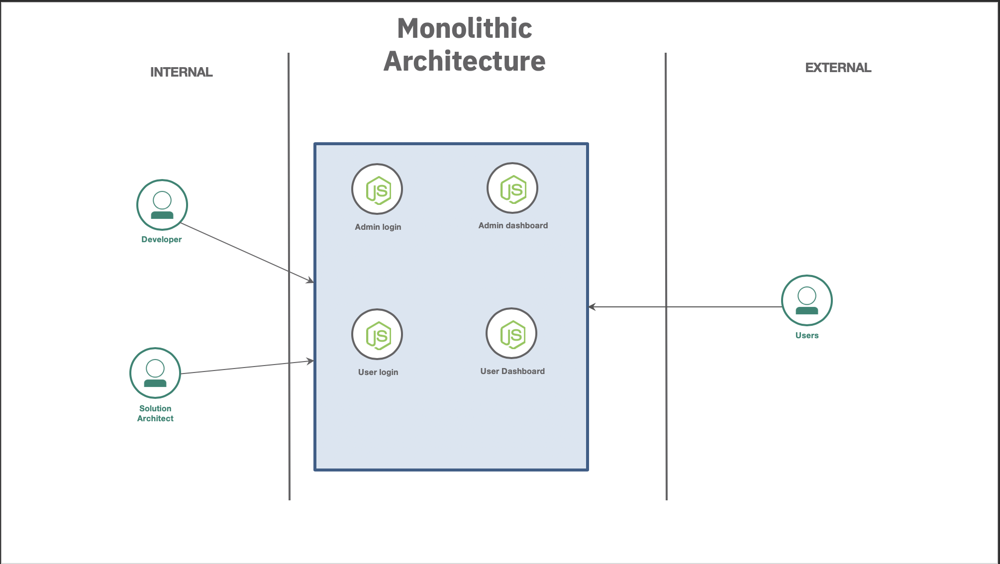

There are five tightly coupled services within this application:

* Admin login (`admin_login.ejs`)
* Admin dashboard (`admin.ejs`)
* User login (`user_login.ejs`)
* User dashboard (`users.ejs`)
* Not found (`notfound.ejs`)

If too much workload or user traffic occurs on one service, then all of the other interconnected services can be affected. Or the complete project can go down, which is one of the major disadvantages of monolithic architectures.

To break down this monolithic application, you separate the admin services (`admin_login.ejs` and `admin.ejs`) and user services (`user_login.ejs` and `users.ejs`) into microservices so they can run independently. Both services have different functions, so the new application is able to scale them depending on the workload. The two new microservices are:

* [Admin microservice](https://github.com/mahsankhaan/micro-admin)
* [User microservice](https://github.com/mahsankhaan/micro-user)

To do this, you put the admin services into one project and the user services into another, and then deploy them both to a central GitHub repo. Both have their own dependencies and run independently, as you can see in the following architecture diagram. (Don't worry if this does not fully make sense to you right now. The tutorial steps explain it further.)

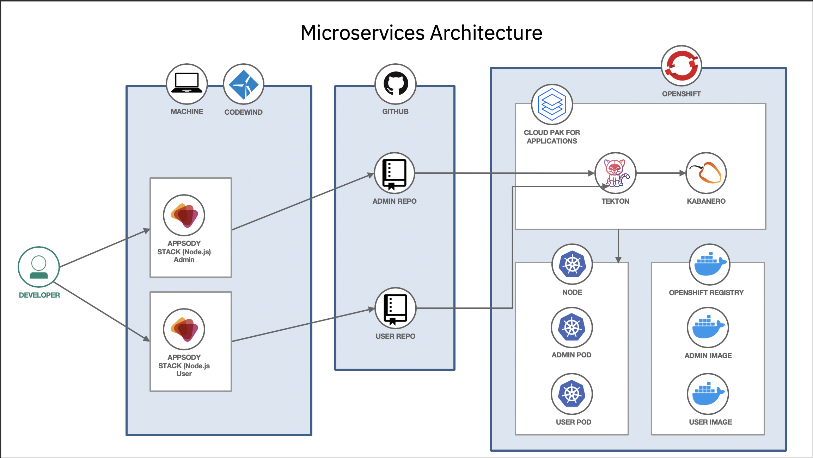

## Prerequisites

To complete the steps in this tutorial, you need:

* [Docker](https://docs.docker.com/install/) on your local computer.
* [Visual Studio Code](https://code.visualstudio.com/) for local development.
* Access to a [Red Hat OpenShift on IBM Cloud](https://cloud.ibm.com/kubernetes/catalog/openshiftcluster/?cm_sp=ibmdev-_-developer-tutorials-_-cloudreg) cluster with [IBM Cloud Pak for Applications](https://cloud.ibm.com/catalog/content/ibm-cp-applications-b4fbe4b9-a9de-406a-94de-5e0c7dc20bf7-global/?cm_sp=ibmdev-_-developer-tutorials-_-cloudreg).
* A [GitHub](https://github.com/) account and some knowledge of git commands.

## Estimated time

After the prerequisites are installed, this tutorial will take 90min to complete the steps.

## Steps

1. [Clone the GitHub repository](#step-1-clone-the-github-repository)
1. [Install Codewind in Visual Studio to create a microservice test and deploy to GitHub](#step-2-install-codewind-in-visual-studio-to-create-a-microservices-test-and-deploy-to-GitHub)
1. [Create GitHub tokens](#step-3-create-github-tokens)
1. [Initialize Tekton and integrate with the central GitHub repository](#step-4-initialize-tekton-and-integrate-with-the-central-github-repository)
1. [Verify that the microservices are up and running](#step-5-verify-that-the-microservices-are-up-and-running)

### Step 1. Clone the GitHub repository

1. Open your terminal and change your directory by using the `cd downloads` command. (Or any other directory in which you want to clone the project.)
1. Run the command: `git clone https://github.com/mahsankhaan/cloud-pak-for-applications.git`.
1. Open the project in Visual Studio.

   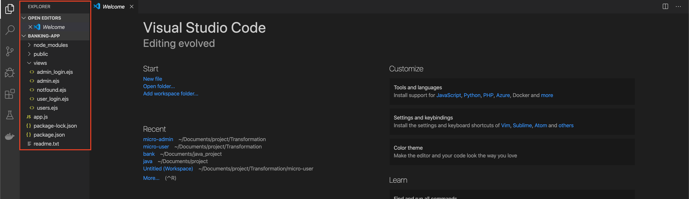

### Step 2. Install Codewind in Visual Studio to create a microservice test and deploy to GitHub

#### What is Codewind and why does this tutorial use it?

In the present era, one of the biggest challenges for a developer is to build and deploy cloud-native applications. Many actions are required to build a perfect solution on the cloud and you need to build images, create containers, debug, analyze the different logs, assess performance metrics, and rebuild the containers with each code change. That's why this tutorial uses Codewind, an opensource project that helps you achieve all of the above actions really quicky with ready-made, container-based project templates and can easily be integrated with your visual code integrated development environment (IDE). [Learn more about Codewind.](https://www.eclipse.org/codewind)

Since you know which services will be converted into microservices, start by initializing Codewind in Visual Studio with the following tasks:

1. Open Visual Studio.
1. Select **Extensions** and search for Codewind.
1. Select **Install** and kindly wait, since it will take some time to initialize.
1. Once successfully installed, you will see the Codewind section.
1. Select **Codewind** and start the local Codewind.
1. Right-click **local** and select **Create New Project**.
1. Select **Kabanero Node.js Express simple template**.
1. Select the folder where you want to initialize the template and name it `micro-admin`. (This step can take five to ten minutes to initalize.)
1. Once your template is initalized successfully, kindly open the folder where you created `micro-admin`. You will see the newly created template.

   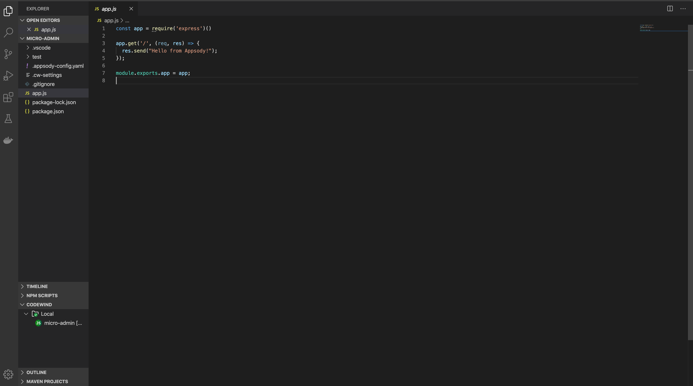

   Next, you will break down the monolithic application in three stages.

1. First, visit the folder where you cloned the monolithic application in [Step 1](#step-1-clone-the-github-repository). In that folder, open the `app.js` file and copy the following lines:

  ```
  const express = require("express")
  const path = require('path');
  const app = express();
  app.set('view engine', 'ejs');
  app.set('views', path.join(__dirname, 'views'));
  app.use(express.static(path.join(__dirname, 'node_modules')));
  app.use(express.static(path.join(__dirname, 'public')));

  app.get("/", function(req,res){
      res.render("admin_login");
  });
  app.get("/admin_login", function(req,res){
      res.render("admin_login");
  });
  app.get("/admin_in", function(req,res){
      var Name = req.query.name;
      var Password = req.query.pass;
  if (Password =="123")
  {
    console.log("Successfully logged in as admin");
    res.render("admin");
  }
  else{
      res.render("notfound.ejs");
  }
  });
  module.exports.app = app;
  ```

   Then, go to your new `micro-admin` folder and replace the `app.js` file with the copied version.

1. Second, copy the complete **public** folder located within the folder where you [cloned the monolithic application](#step-1-clone-the-github-repository), and paste it into your new `micro-admin` folder.
1. Third, open the **views** folder located within the folder where you [cloned the monolithic application](#step-1-clone-the-github-repository), and copy only the `admin.ejs`, `admin_login.ejs`, and `notfound.ejs` files. Paste those files into your new `micro-admin` folder.

   Your structure should now look like the following:

   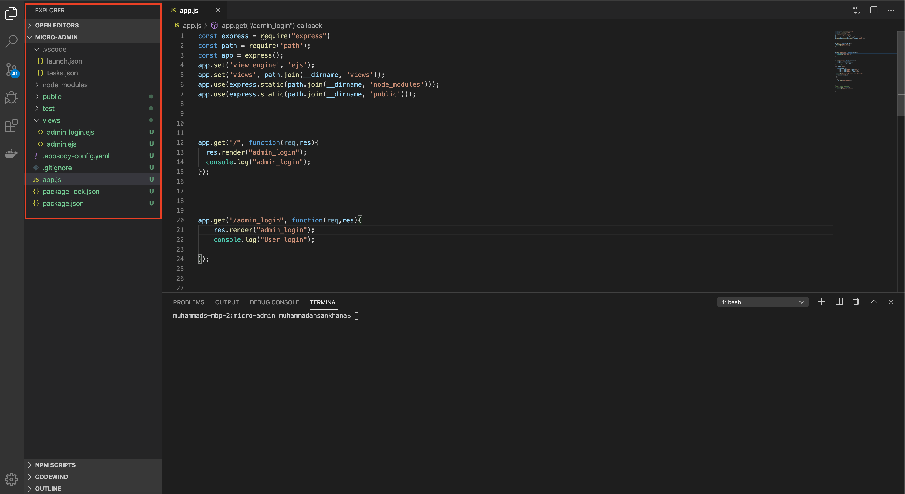

1. Open your terminal inside Visual Studio and run the command `npm install ejs`. This will install the Embedded JavaScript templating that you will use for front-end styling.
1. Go to **Codewind** in Visual Studio and look for your project there, running as `micro-admin`. Right-click it and select **Open Application** to open the page. From there, select **enable project** (if it is disabled) and then select **build**. Check **Application Endpoint** to see where your application is running.
1. To test your application, right-click `micro-admin`, select **Application Monitor**, and hit the application two or three times to see the changes.

  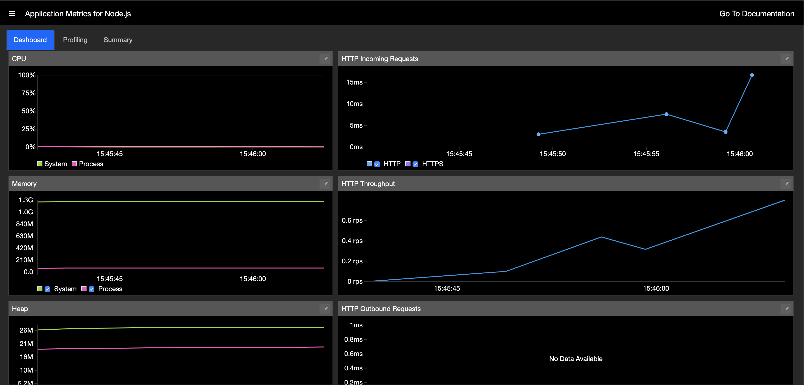

1. Run `appsody build` in your Visual Studio terminal. You don't have to worry and spend your time on a deployment configuration file since Codewind will create it for you. You only need to focus on your application development.
1. After the above command executes successfully, you will see a new generated file called `app-deploy.yaml` on the left hand side of your screen. This file will help you in a later step to deploy the application on Cloud Pak for Applications.

   *Note:* If you do not have a namespace section, please add it as follows:

  ```
  apiVersion: appsody.dev/v1beta1
  kind: AppsodyApplication
  metadata:
    namespace: kabanero
    creationTimestamp: null
    labels:
      image.opencontainers.org/title: micro-admin
      stack.appsody.dev/id: nodejs-express
      stack.appsody.dev/version: 0.2.8
    name: micro-admin
    ....
  ```

  You successfully created the Admin microservice.

1. Go back to the beginning of this [Step](#step-2-install-codewind-in-visual-studio-to-create-a-microservices-test-and-deploy-to-GitHub) and repeat tasks 6 to 17 to create the second microservice, naming it `micro-user`.

   This time, your `app.js` file will be for users, so copy the code below during task 10:

  ```
  const express = require("express")
  const path = require('path');
  const app = express();
  app.set('view engine', 'ejs');
  app.set('views', path.join(__dirname, 'views'));
  app.use(express.static(path.join(__dirname, 'node_modules')));
  app.use(express.static(path.join(__dirname, 'public')));

  app.get("/user_login", function(req,res){
      res.render("user_login");
      console.log("User login");
  });
  app.get("/user_in", function(req,res){
      var Name = req.query.name;
      var Password = req.query.pass;
  if (Password =="123")
  {
    console.log("Successfully logged in as user");
    res.render("users");
  }
  else{
      res.render("notfound.ejs");
  }
  });
  app.listen(3000 , function(){
      console.log("App is running");
  });
  ```

   Also, after task 12, you should see a structure like this for your new `micro-user` folder:

  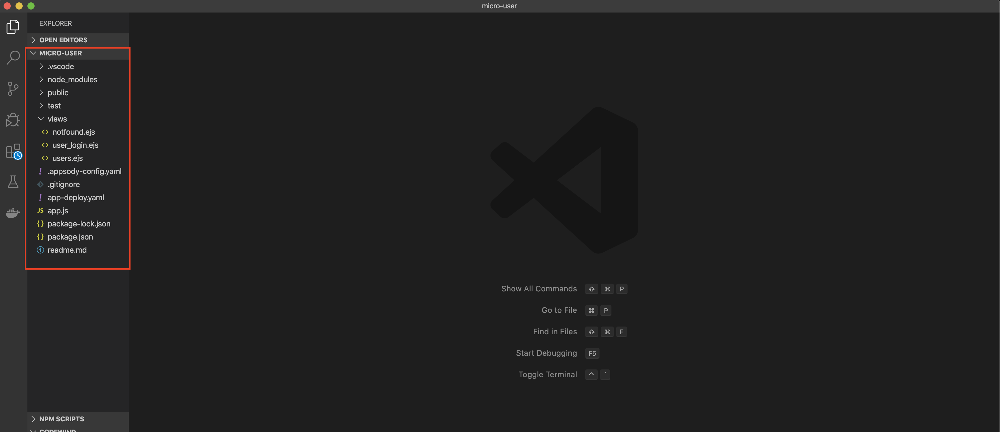

   Once you finish testing and creating the User microservice, individually upload both microserves to the central GitHub repository.

*Note:* If you have any difficulty executing this step to create both microservices, please check out the following sample repositories that were created using Codewind:

* [Admin microservice](https://github.com/mahsankhaan/micro-admin.git)
* [User microservice](https://github.com/mahsankhaan/micro-user.git)

### Step 3. Create GitHub tokens

Before you initialize Tekton, it is really important to create two GitHub tokens for your admin and user microservices:

1. Open [GitHub](https://github.com/) and log into your account.
1. Click your profile photo to expand the account profile menu.
1. Within the menu, click **Settings > Developer settings > Personal access tokens**.
1. Click the **Generate new token** button.
1. Give your first token a descriptive name by typing `tekton-app-user` into the **Note** field.
1. Select the scopes, or permissions, you'd like to grant this token. To use your token to access repositories from the command line, select the **repo** checkbox.

   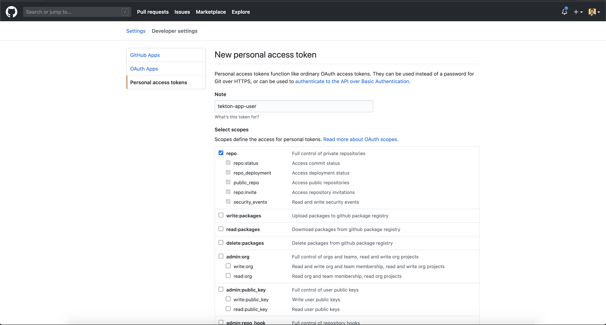

1. Click the **Generate token** button.
1. Copy the token to your clipboard. *It is important that you do this.* For security reasons, after you navigate off the page, you will not be able to see the token again.
1. To create your second token, click the **Generate new token** button again.
1. Give your second token a descriptive name by typing `tekton-app-admin` into the **Note** field.
1. Select the scopes, or permissions, you'd like to grant this token. To use your token to access repositories from the command line, select the **repo** checkbox.
1. Click the **Generate token** button.
1. Copy the second token to your clipboard. *It is important that you do this for both tokens.*

   Once both tokens are created, you will see a page similar to the one below:

   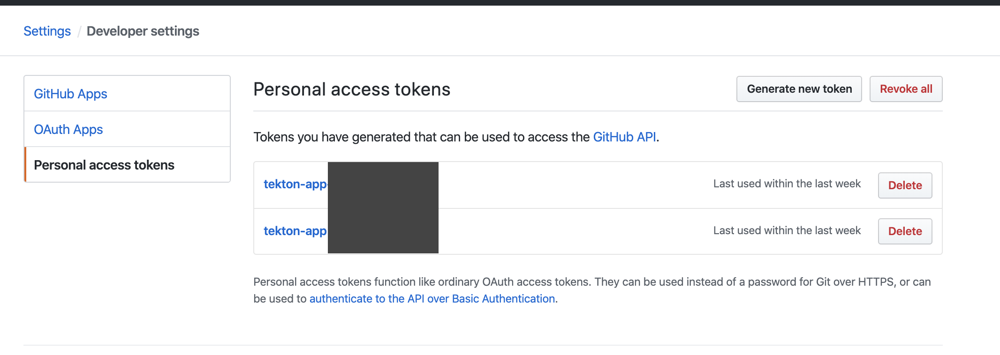

### Step 4. Initialize Tekton and integrate with the central GitHub repository

#### What is Tekton and why does this tutorial use it?

Tekton is a powerful, yet flexible, Kubernetes-native open source framework for creating continuous integration and continuous delivery (CI/CD) systems. This tutorial uses Tekton because it is a built-in tool for IBM Cloud Pak for Applications that connects the GitHub central repository and a webhook that lifts and shifts application source code from your local development to the cloud. [Learn more about Tekton.](https://developer.ibm.com/articles/introduction-to-tekton-architecture-and-design/)

To initialize Tekton, perform the following tasks:

1. Open your Red Hat OpenShift web console.
1. Once you are logged in successfully, select **Kabanero** from the __My Project__ section.
1. Select **Cloud Pak for Applications** from the menu.
1. You should see the following screen:

   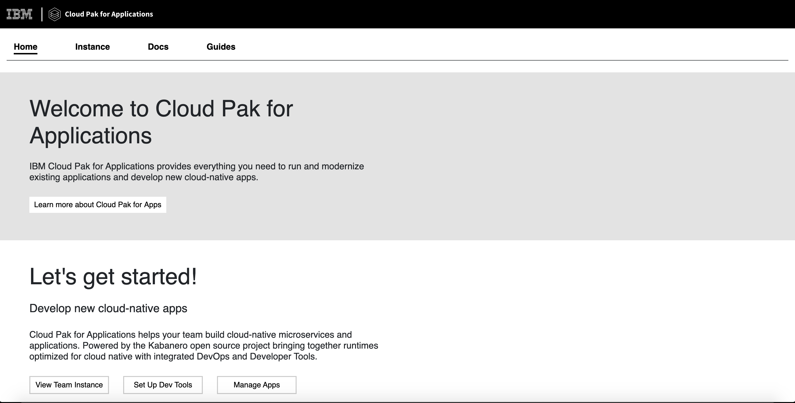

1. Click the __Instance__ tab.
1. Within the __Tools__ section, select **Tekton**. You should see the following screen:

   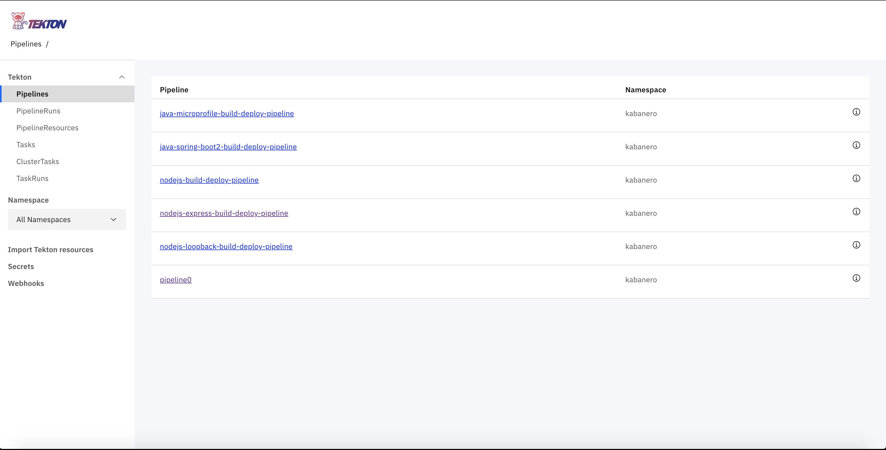

1. Select **Webhooks** from the menu and proceed to create two webhooks for your microservices (`micro-admin` and `micro-user`).
1. For the first webhook, enter `w1-admin` in the __Name__ field, `https://github.com/mahsankhaan/micro-admin.git` in the __Repository URL__ field, and `micro-token-1` in the __Access Token__ field.

   

   Click __Create__.

1. For the second webhook, enter `w2-user` in the __Name__ field, `https://github.com/mahsankhaan/micro-user.git` in the __Repository URL__ field, and `micro-token-2` in the __Access Token__ field. Click __Create__.


   


1. Check, Tekton and GitHub are successfully connected by opening your micro and admin repositories. Go to __micro-admin__ repository,under __settings__ select __Webhooks__ on left menu and if pipeline is connected properly then there must be a link on right `http://w1-admin-6zmvc.kabanero..` (you may have different link) . Kindly follow the same procedure for __micro-user__ repository.  

   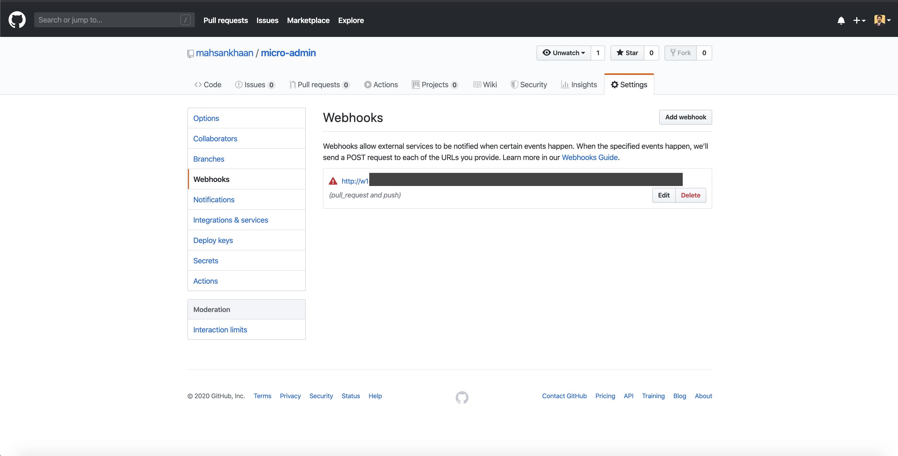

   *Important:* Do not worry if you get an error notice. This will resolve after the repositry code is updated.

1. Now lets make some changes in micro-admin and micro-user repositries that were created in [step 2](#step-2-install-codewind-in-visual-studio-to-create-a-microservices-test-and-deploy-to-GitHub) to trigger our Tekton pipeline. First open __micro-admin__ repo and inside views folder open __admin.ejs__ file and make some change like search for "My Dashboard" text and make it capital "MY DASHBOARD", once you are done __commit__ the file. Perform same procedure for __micro-user__(make change in user.ejs)file.

1. Next, open your Tekton dashboard. Under the Tekton dropdown list, select **PipelineRuns**.
1. Wait until the rows under the **Status** column display `All tasks completed executing`, which indicates you successfully integrated your central repo to your Tekton instance on IBM Cloud Pak for Applications.  

   *Important:* Perform the changes in each repository separately. For example, perform the changes in the User repository first and after it is successfully built and deployed, then update the Admin repository. Or vice versa.

   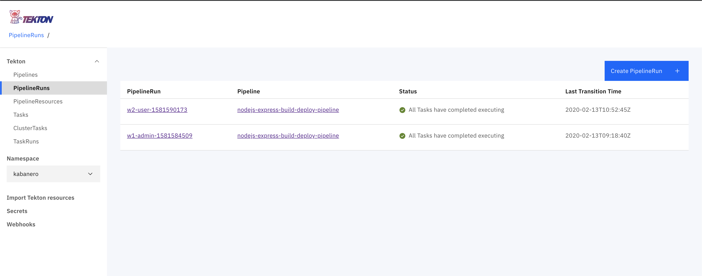

For more details about Tekton, check out [this great tutorial](https://developer.ibm.com/tutorials/deploy-appsody-to-openshift-with-tekton-pipelines/).

### Step 5. Verify that the microservices are up and running

1. Open the OpenShift dashboard.
1. Select **Applications** from the menu.
1. Select **Routes** and you should then see your two microservices up and running on the Routes page.
1. To run the application, click the links within the **Hostname** column.

   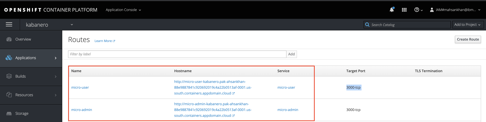

   Here is a sample screen capture of the user interface:

   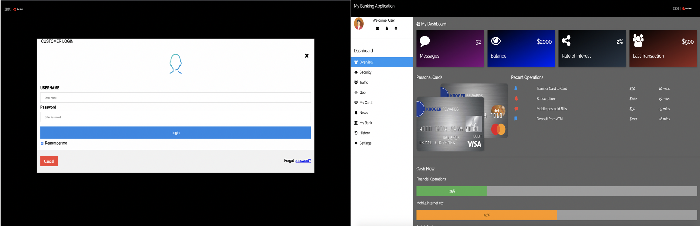

   Here is a sample screen capture of the admin interface:

   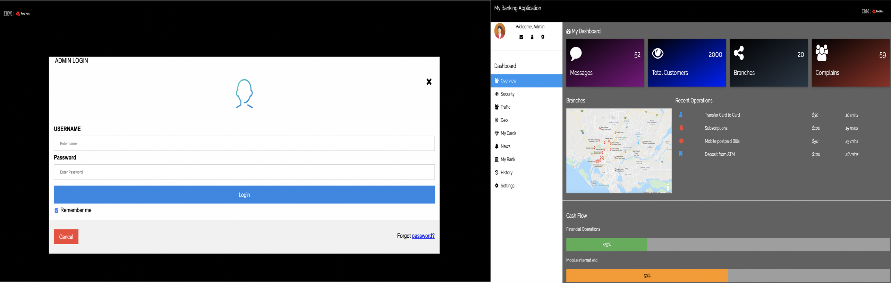

## Conclusion

In this tutorial, you learned how to modernize a Node.js application, transforming it from a monolithic architecture into a microservices architecture using Cloud Pak for Applications. By independently running two projects containing related services, you can scale them depending on the workload. In addition, you can  integrate as many microservices as you want without affecting or scaling down the complete project.
